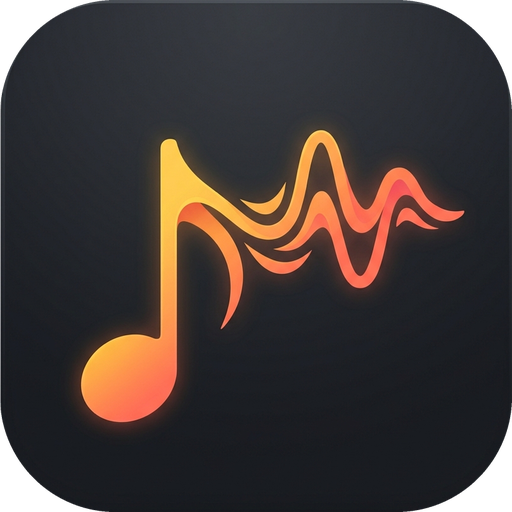
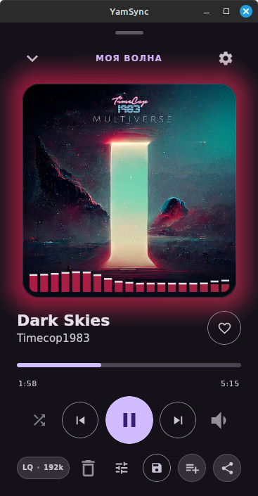
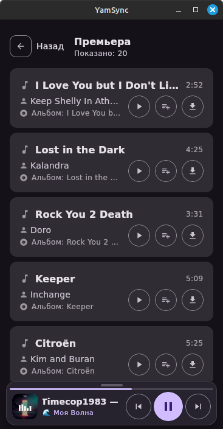
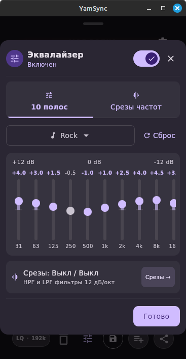
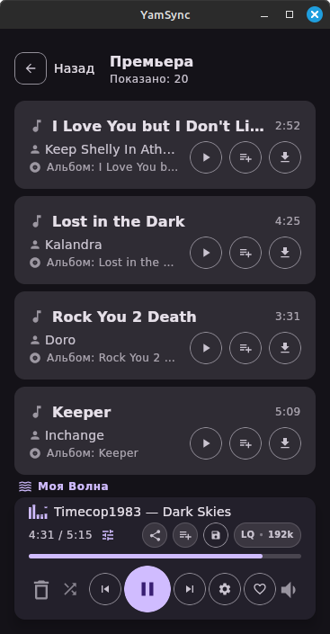
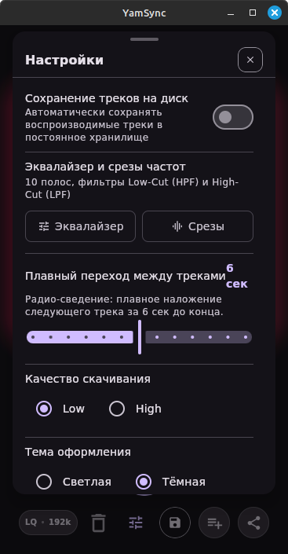

<p align="center">
  
</p>

<h1 align="center">YamSync</h1>

<p align="center">
  <b>Современный кроссплатформенный аудиоплеер и загрузчик треков для Яндекс Музыки</b><br>
  Создан на базе <b>Kotlin Multiplatform (KMP)</b> и <b>Compose Multiplatform</b> для Desktop (Linux, Windows, macOS), iOS и Android.
</p>

<p align="center">
  
  
  
  
  <a href="https://t.me/+5PT1eAkb7CxjYzNi">
    
  </a>
  <a href="LICENSE">
    
  </a>
</p>

---

## 📸 Скриншоты

<p align="center">
  <table align="center" style="border: none; border-collapse: collapse; margin: 0 auto;">
    <tr align="center" valign="top">
      <td align="center" style="border: none; padding: 6px;">
        <br>
        <sub><b>🌊 Моя Волна и Плеер</b></sub>
      </td>
      <td align="center" style="border: none; padding: 6px;">
        <br>
        <sub><b>📜 Плейлисты и Поиск</b></sub>
      </td>
      <td align="center" style="border: none; padding: 6px;">
        <br>
        <sub><b>🎚️ 10-полосный EQ и Срезы</b></sub>
      </td>
      <td align="center" style="border: none; padding: 6px;">
        <br>
        <sub><b>🖥️ Десктоп / Winamp вид</b></sub>
      </td>
      <td align="center" style="border: none; padding: 6px;">
        <br>
        <sub><b>⚙️ Настройки и Синхронизация</b></sub>
      </td>
    </tr>
  </table>
</p>

---

## 📥 Скачать (Готовые сборки)

Готовые установочные пакеты доступны на странице **[GitHub Releases](https://github.com/audiz/YamSync/releases/latest)**:

| Платформа | Формат | Описание | Ссылка на загрузку |
| :--- | :--- | :--- | :--- |
| 🤖 **Android** | `.apk` | Смартфоны и планшеты (Android 8.0+) | [Скачать APK](https://github.com/audiz/YamSync/releases/latest) |
| 🪟 **Windows** | `.msi` / `.exe` | Windows 10 / 11 (x64) | [Скачать для Windows](https://github.com/audiz/YamSync/releases/latest) |
| 🐧 **Linux** | `.deb` / `.rpm` | Ubuntu, Debian, Fedora, Arch и др. | [Скачать для Linux](https://github.com/audiz/YamSync/releases/latest) |
| 🍏 **macOS** | `.dmg` | macOS 12+ (Apple Silicon и Intel) | [Скачать DMG](https://github.com/audiz/YamSync/releases/latest) |
| 📱 **iOS** | `.ipa` | iPhone & iPad (iOS 15+) | [Скачать IPA](https://github.com/audiz/YamSync/releases/latest) |

> [!NOTE]
> **Установка на iOS (Sideloading):**  
> Файл `.ipa` устанавливается без джейлбрейка через **AltStore**, **SideStore**, **Sideloadly**, **TrollStore** или **Scarlet**.

---

## ✨ Ключевые возможности

### 🎧 Продвинутый аудиоплеер и стриминг
- **Мгновенный потоковый запуск (Zero-Latency Chunked Streaming):** треки начинают звучать за 100–200 мс без ожидания скачивания файла целиком.
  - На Desktop: локальный потоковый буфер с обработкой аудиопотока на лету.
  - На iOS: каноничная реализация `AVAssetResourceLoaderDelegate` (`yamusic-stream://`), запрашивающая аудиопоток чанками через Ktor.
- **Персональный бесконечный поток «Моя Волна»:** нативная интеграция по протоколу Ynison WebSocket с получением персонализированных рекомендаций в реальном времени.
- **Быстрый доступ к медиатеке:** плейлисты «Любимые треки», «История прослушиваний», ежедневные подборки («Дежавю», «Премьера», «Плейлист дня»).
- **Полное управление:** перемешивание (Shuffle), повтор трека (Loop), добавление/удаление из плейлистов, управление очередью воспроизведения.

### 🎚️ Профессиональный DSP-эквалайзер и фильтры
- **10-полосный графический эквалайзер:** точная калибровка амплитуды от -12 дБ до +12 дБ для частот 31 Гц, 63 Гц, 125 Гц, 250 Гц, 500 Гц, 1 кГц, 2 кГц, 4 кГц, 8 кГц, 16 кГц.
- **Фильтры среза частот (Cut Filters):**
  - **Low-Cut (HPF):** отсечение нежелательного суб-басового гула и перегрузки динамиков.
  - **High-Cut (LPF):** устранение чрезмерного высокочастотного шипения и резкости.
  - Крутизна спада фильтров: 12 дБ/октава.
- **Пресеты звучания:** готовые конфигурации (Rock, Pop, Bass Boost, Vocal, Flat и др.) с возможностью тонкой ручной подстройки (Custom) и мгновенным сбросом.

### 📊 Живой спектроанализатор (Audio Visualizer)
- **Честный захват PCM-звука:**
  - На Desktop: параллельный IIR-анализ звукового потока.
  - На iOS: интеграция с нативным `MTAudioProcessingTap` (MediaToolbox), снимающим `Float32` PCM-сэмплы прямо из аппаратного аудиовыхода `AVPlayerItem`.
- **Живая анимация в такт музыке:** миниатюрный эквалайзер рядом с играющим треком и в панели плеера танцует строго в ритм бочки и баса, а не по случайному таймеру.

### 🔗 Deep Links (`yamsync://`) и системный шеринг
- **Мгновенный запуск по ссылкам:** клик по ссылке формата `yamsync://track/<id>` из Telegram, WhatsApp, Заметок или браузера автоматически запускает приложение и начинает воспроизведение трека.
- **Нативный Share Sheet:** удобная отправка названия трека и прямых ссылок через системные диалоги (iOS Share Sheet, буфер обмена).

### 💾 Загрузка и управление хранилищем
- **Высокое качество звука:** выбор битрейта (Low / High).
- **Режим автозаписи на диск:** автоматическое сохранение всех прослушиваемых треков в постоянное локальное хранилище.
- **Полные метаданные:** автоматическое вшивание ID3 / MP4 тегов (исполнители, названия, обложки альбомов в максимальном разрешении).
- **Управление кешем:** очистка кеша плейлистов и локальных треков в один клик.

### 🖥️ Системная интеграция и темы
- **Аппаратные клавиши и медиавиджеты ОС:**
  - Linux MPRIS (управление с панели задач, клавиатуры и локскрина).
  - Windows SMTC (системный оверлей громкости и управления воспроизведением).
  - iOS Now Playing Info Center и Remote Command Center (управление с экрана блокировки и Dynamic Island).
- **Material Design 3:** адаптивный интерфейс с поддержкой Светлой и Тёмной тем оформления.

---

## 🔑 Авторизация (Подключение аккаунта)

Для загрузки треков в высоком качестве, доступа к персональной медиатеке и потоку «Моя Волна» требуется авторизация с аккаунтом Яндекс Плюс.

### Способ 1: Быстрая авторизация через браузер (Рекомендуемый)
1. Откройте **Настройки** (иконка шестерёнки в приложении).
2. В разделе **«Авторизация в Яндекс Музыке (OAuth)»** нажмите кнопку **«🌐 1. Получить токен в браузере»**.
3. В открывшемся окне браузера войдите в свой аккаунт Яндекс и подтвердите доступ.
4. После перенаправления скопируйте всю ссылку из адресной строки браузера (содержит `#access_token=AQAAAA...`) или только сам токен.
5. Вставьте ссылку или токен в поле ввода приложения и нажмите **«💾 2. Сохранить токен»**.

### Способ 2: Прямая ссылка на получение OAuth-токена
```text
https://oauth.yandex.ru/authorize?response_type=token&client_id=23cabb9da7144e6792942475a3b68078
```
После подтверждения скопируйте `access_token` из адресной строки и сохраните в настройках YamSync.

---

## ⌨️ Мультимедиа-контроль и интеграция с ОС

YamSync нативно интегрирован в мультимедийные интерфейсы поддерживаемых платформ:
- **Аппаратные клавиши управления:** клавиши `Play/Pause`, `Next`, `Previous`, `Mute` на клавиатурах, гарнитурах и Bluetooth-наушниках работают из коробки.
- **Linux:** интеграция по стандарту **MPRIS2** (управление через системный трей, апплеты панелей GNOME / KDE и локскрин).
- **Windows:** системный медиаоверлей **SMTC** (System Media Transport Controls) с обложкой трека и кнопками навигации.
- **iOS:** нативный **Now Playing Info Center** и **Remote Command Center** (управление с экрана блокировки, Dynamic Island и Apple Watch).
- **Android:** уведомление медиасессии с полнофункциональными кнопками управления и виджетом на экране блокировки.

---

## ❓ Часто задаваемые вопросы (FAQ)

<details>
<summary><b>🔒 Безопасно ли сохранять OAuth-токен в приложении?</b></summary>
<p>
Да, полностью безопасно. Токен сохраняется исключительно в локальном хранилище вашего устройства и отправляется только напрямую на официальные серверы Яндекс Музыки по защищённому протоколу HTTPS. В приложении отсутствуют сторонние серверы, телеметрия или аналитические трекеры.
</p>
</details>

<details>
<summary><b>⭐ Обязательна ли подписка Яндекс Плюс?</b></summary>
<p>
Для неограниченного воспроизведения бесконечного потока «Моя Волна» и скачивания аудиофайлов в максимальном качестве (HQ / Lossless) требуется аккаунт с активной подпиской Яндекс Плюс. Без подписки доступны только ознакомительные 30-секундные превью согласно политике платформы.
</p>
</details>

<details>
<summary><b>📁 Куда сохраняется загруженная музыка?</b></summary>
<p>
По умолчанию треки сохраняются в стандартную системную папку «Музыка» (Music) текущего пользователя. В настройках приложения путь сохранения можно в любой момент изменить на любую удобную директорию (включая внешние диски и SD-карты).
</p>
</details>

<details>
<summary><b>✈️ Можно ли слушать скачанные треки без интернета?</b></summary>
<p>
Да. Все сохранённые на устройство треки доступны для офлайн-воспроизведения без необходимости подключения к сети.
</p>
</details>

---

## 🛠 Стек технологий

- **Язык:** [Kotlin 2.x](https://kotlinlang.org/)
- **UI:** [Compose Multiplatform](https://www.jetbrains.com/lp/compose-multiplatform/) (Material 3)
- **Сетевой слой:** Ktor Client, OkHttp, Kotlinx Serialization, Ynison WebSocket
- **Аудио-движки:**
  - **Desktop (JVM):** JavaFX Media + программный fallback (JLayer / JFlac) + IIR DSP фильтры
  - **iOS:** Apple AVFoundation (`AVPlayer`, `AVAssetResourceLoaderDelegate`), `MediaToolbox` (`MTAudioProcessingTap`)
  - **Android:** Android MediaPlayer / ExoPlayer
- **Системные сервисы:** Linux MPRIS2 (D-Bus), Windows SystemMediaTransportControls, iOS MediaPlayer framework

---

## 📦 Сборка и запуск

Для сборки проекта требуются **JDK 17+** и установленные средства платформы (Android SDK для Android, Xcode для iOS).

### 🖥 Desktop (Windows / Linux / macOS)

> [!TIP]
> **Требование для качественного звука на ПК (FFmpeg):**  
> Для полноценной работы аудиодвижка на Desktop (программный бесшовный кроссфейд треков, воспроизведение форматов FLAC / AAC / M4A и спектроанализатор) рекомендуется наличие **FFmpeg** в системе:
> - **Linux (Ubuntu / Debian / Mint):** `sudo apt install ffmpeg`
> - **Linux (Arch / Manjaro):** `sudo pacman -S ffmpeg`
> - **Linux (Fedora):** `sudo dnf install ffmpeg`
> - **macOS:** `brew install ffmpeg`
> - **Windows:** `winget install Gyan.FFmpeg` *(или `choco install ffmpeg`)*

**Запуск в режиме разработки:**
```bash
./gradlew :desktopApp:run
```

**Сборка нативного установщика / дистрибутива под текущую ОС:**
```bash
./gradlew :desktopApp:packageDistributionForCurrentOS
```
> Готовые пакеты (`.deb` / `.rpm` для Linux, `.msi` / `.exe` для Windows, `.dmg` для macOS) будут сформированы в:  
> `desktopApp/build/compose/binaries/main/`

---

### 📱 iOS

Сборка и запуск выполняются через Xcode:
1. Откройте проект `iosApp/iosApp.xcodeproj` в Xcode.
2. Выберите симулятор или подключенное физическое устройство iPhone/iPad.
3. Нажмите **Run** (Cmd + R).

Или через Gradle:
```bash
./gradlew :shared:compileKotlinIosArm64
```

---

### 🤖 Android

**Сборка Debug APK:**
```bash
./gradlew :androidApp:assembleDebug
```
> Готовый APK файл:  
> `androidApp/build/outputs/apk/debug/androidApp-debug.apk`

**Установка на подключенное Android-устройство:**
```bash
./gradlew :androidApp:installDebug
```

---

## 📁 Структура проекта

- **`:core`** — сетевой клиент, работа с API Яндекс Музыки, модели данных и кросс-модульное логирование (`CoreLogger`).
- **`:shared`** — единая бизнес-логика, архитектура, Compose UI экраны и компоненты:
  - `commonMain` — кроссплатформенный UI, управление плейлистами, 10-полосный DSP-эквалайзер, Deep Link обработчик.
  - `jvmMain` — десктопная реализация аудио (JavaFX), системная интеграция (Linux MPRIS, Windows SMTC).
  - `iosMain` — iOS плеер на `AVPlayer`, чанковый потоковый стриминг (`AudioResourceLoaderDelegate`), нативный мост аудио-тапа (`IosAudioTapBridge`), iOS Share Sheet.
  - `androidMain` — адаптация плеера и системных сервисов для Android.
- **`:desktopApp`** — точка входа и конфигуратор сборки дистрибутивов ПК.
- **`:iosApp`** — нативное iOS приложение на Swift/SwiftUI, системный `MTAudioProcessingTap` (спектроанализатор) и перехватчик `yamsync://` URL.
- **`:androidApp`** — точка входа, конфигурация Android Application и манифест.

---

## 🗺️ Планы развития (Roadmap)

- [ ] 🎤 Синхронизированные тексты песен (Lyrics / Караоке в реальном времени)
- [ ] 📊 Скробблинг истории прослушиваний в Last.fm
- [ ] 🎙️ Раздел подкастов и аудиокниг
- [ ] 🚗 Поддержка Android Auto и Apple CarPlay
- [ ] ⏱️ Таймер сна (Sleep Timer)

---

## 💬 Сообщество и обратная связь

Присоединяйтесь к нашему Telegram-сообществу пользователей и разработчиков:

<p align="center">
  <a href="https://t.me/+5PT1eAkb7CxjYzNi">
    
  </a>
</p>

- 🚀 Обсуждение обновлений и тестирование свежих сборок
- 💡 Идеи, пожелания и предложения новых возможностей
- 🐛 Сообщения о багах и оперативная помощь по настройке
- 🤝 Живое общение пользователей YamSync

👉 **Ссылка на чат:** [https://t.me/+5PT1eAkb7CxjYzNi](https://t.me/+5PT1eAkb7CxjYzNi)

---

## 📄 Лицензия

Проект распространяется под свободной лицензией **GNU General Public License v3.0 (GPL-3.0)**. Полный текст лицензии доступен в файле [LICENSE](LICENSE).

---

## ⚖️ Дисклеймер

Проект создан исключительно в ознакомительных и образовательных целях. Все права на товарные знаки и медиаконтент принадлежат их правообладателям и ООО «Яндекс».

